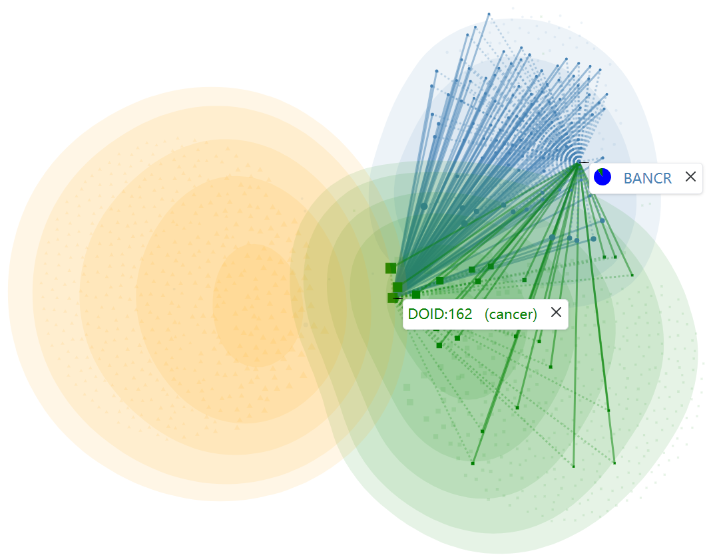

We did a visual analysis of dataset 1 and found that its original authors probably used the following logical reasoning in the construction process of the dataset in some cases: If a certain lncRNA L is associated with a disease D, then it is inferred that L is associated with the ancestral diseases of D. For example, as shown in the following figure, based on dataset 1, we plotted the association information centered on DOID: 4 (Cancer) and the pathways between DOID:162 and lncRNA BANCR.

Disease DOID:162 (Cancer) - LncRNA BANCR | Disease DOID:162 (Cancer)
:-------------------------:|:-------------------------:
 | 

Green squares indicate diseases, blue circles indicate lncRNAs, and yellow triangles indicate miRNAs, with the size of the nodes being proportional to the degree. In the picture on the left, The "blue solid line - blue dashed line " indicates the "disease - lncRNA - similar lncRNA" pathway, and the "green dashed line - green solid line " indicates the "disease - similar disease - lncRNA" pathway. In the picture on the right, specifically, both the blue solid lines and the purple solid lines indicate the lncRNA-disease associations recorded in dataset 1, while the blue ones have records of literature evidence in the original datasets lnc2Cancer and lncRNADisease, and the purple ones indicate that there is no record, they are mostly derived from the above logical reasoning. Like BANCR is associated with some specific cancers of the gastric, lung, and breast, then it has been theorized to be associated with cancer. It is obvious that the purple solid lines account for a considerable proportion.

And In the construction process of dataset 2, we did not use the logical reasoning described above, we respected the original literature evidence records in lnc2Cancer and lncRNADisease. So we can explain why the performance is so different on these two datasets, it doesn’t mean the method is not robust and only functions on a specific dataset, it is the result of the innate difference in the construction of the datasets. It’s known that ancestral and descendant diseases are phenotypically similar, so the logical reasoning described above makes dataset 1 more consistent with the underlying assumption of the LDA computational predictions that similar lncRNAs tend to be associated with similar diseases. Therefore, prediction methods prefer to obtain higher evaluation indices on dataset 1. With the exactly same five-fold division and experimental environment, the six baseline models we replicated got higher AUC and AUPR values on dataset 1 than on dataset 2, as did the LDAformer. Meanwhile, focusing on the comparison between methods, LDAformer is optimal.