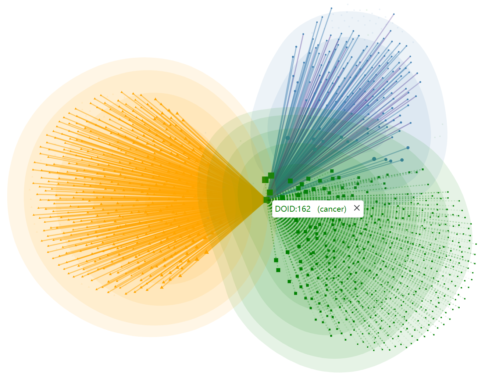

We did a visual analysis of dataset 1 and found that its original authors probably used the following logical reasoning in the construction process of the dataset in some cases: If a certain lncRNA L is associated with a disease D, then it is inferred that L is associated with the ancestral diseases of D. For example, as shown in the above figure, based on dataset 1, we plotted the association information centered on DOID: 4 (cancer). Green squares indicate diseases, blue circles indicate lncRNAs, and yellow triangles indicate miRNAs, with the size of the nodes being proportional to the degree. The green dashed lines indicate the similarities between diseases, and the yellow solid lines indicate the miRNA-diseases associations recorded in dataset 1. Specifically, both the blue solid lines and the purple solid lines indicate the lncRNA-disease associations recorded in dataset 1, while the blue ones have literature evidence in the original datasets lnc2Cancer and lncRNADisease, and the purple ones indicate that there is no original evidence, they are mostly derived from the above logical reasoning. It is obvious that the purple solid lines account for a considerable proportion.

And In the construction process of dataset 2, we did not use the logical reasoning described above, we respected the original literature evidence records in lnc2Cancer and lncRNADisease as much as possible. For dataset 1, such a logical reasoning is correct and alleviates the association sparsity problem to some extent. For dataset 2, it is more conducive to subsequent retrospective analysis. There is no authoritative paradigm on how to construct datasets, and we are neutral on this issue. These are not mentioned in the section "Materials", as the issue is beyond the scope of this manuscript.

So we can explain why the performance is so different on these two datasets, it doesn’t mean the method is not robust and only functions on a specific dataset, it is the result of the innate difference in the construction of the datasets. It’s known that ancestral and descendant diseases are phenotypically similar, so the logical reasoning described above makes dataset 1 more consistent with the underlying assumption of the LDA computational predictions that "similar lncRNAs tend to be associated with similar diseases". Therefore, prediction methods prefer to obtain higher evaluation indices on dataset 1. With the exact same five-fold division and experimental environment, the six baseline models we replicated got higher metrics on dataset 1 than on dataset 2, as did the LDAformer. Meanwhile, LDAformer still achieved the highest metrics on dataset 2.